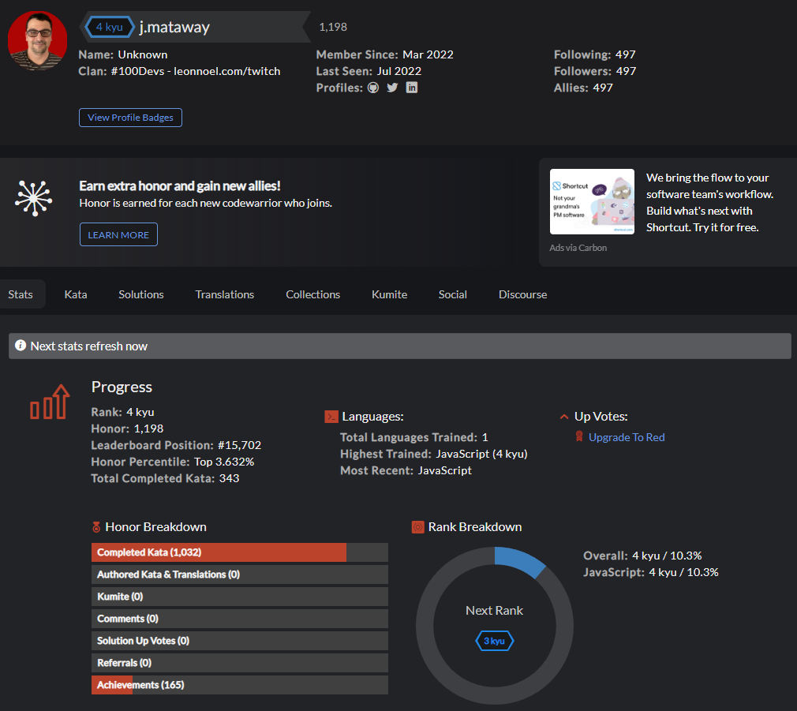

# Codewars <a href="https://www.codewars.com/users/j.mataway" target="_blank">View Here</a>
Repo filled with my daily codewars. Climbing the global leaderboard everyday!

## How It's Made:

## Tech used: 

Every morning I do at least 30 minutes of codewars before anything else.

## Optimizations

Constantly working on refactoring for efficiency and readability. Anti-codegolfer

## Lessons Learned:

Not knowing an answer is okay! There is an endless supply of problems on codewars, accepting that I may not be able to solve all of them immediately was the key.  Spending more time researching and understanding is how I improve.

## Other Projects:

<table bordercolor="#66b2b2">
  
  <tr>
      <td width="33.3%"  style="align:center;" valign="top">
<a target="_blank" href="https://j-mataway.github.io/portfolio/">My Portfolio</a>
         
      
    </td>
    <td width="33.3%"  style="align:center;" valign="top">
<a target="_blank" href="https://j-mataway.github.io/strikers/">Striker's Bowling Alley</a>
         
      
    </td>
    <td width="33.3%" valign="top">
<a target="_blank" href="https://melraemakers.com/">MelRae Makers Blog</a>
       
        
    </td>
  </tr>
</table>

